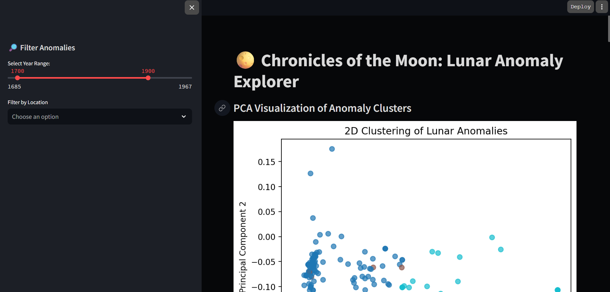
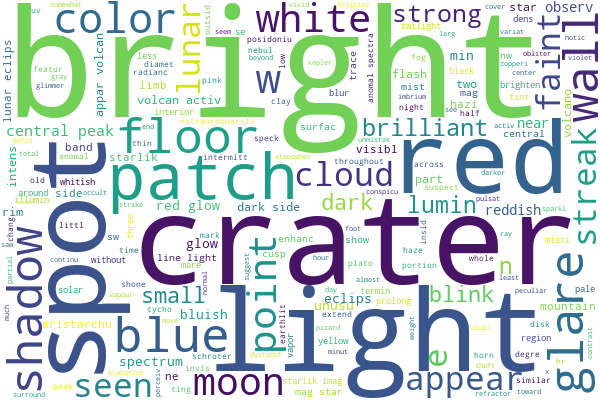
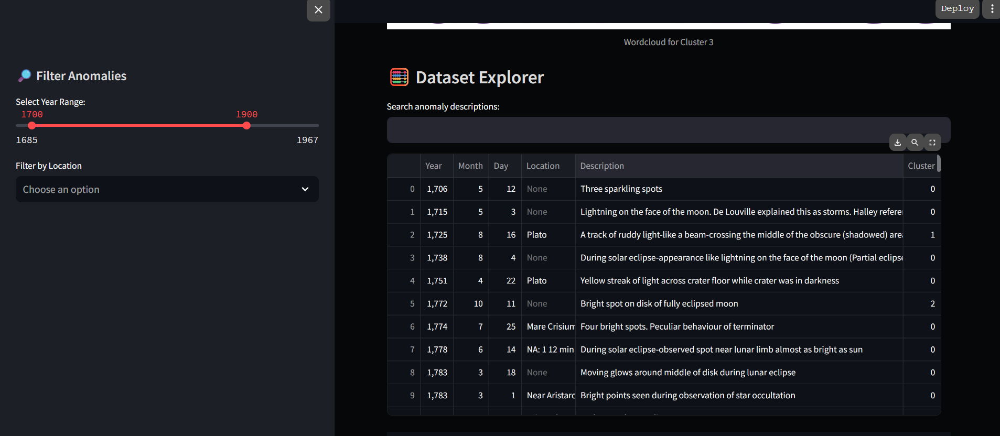

# 🌕 Chronicles of the Moon: Lunar Anomaly Explorer

A Streamlit-based interactive web application that visualizes, filters, and explores lunar anomalies based on NASA’s R-277 report. This app uses NLP, clustering, PCA, and historical moon mission overlays — all wrapped in a moon/space-themed UI.


---

## 🚀 Features

- 🌀 **PCA-based Clustering**: Visualizes anomaly clusters using dimensionality reduction.
- 🔍 **Interactive Filtering**: Filter by year range, location, or search specific anomaly keywords.
- ☁️ **Word Clouds**: Wordclouds summarizing key terms for each anomaly cluster.
- 📅 **Timeline Plot**: Interactive histogram showing frequency of anomalies over time.
- 🛰️ **Moon Mission Overlays**: Highlights key NASA/USSR missions in the anomaly timeline.
- 🌌 **Custom Styling**: Dark moon-inspired CSS theme with background image support.
- 📑 **Data Explorer**: View raw entries with search functionality.

---

## 📂 Folder Structure

```

LunarAnomaliesExplorer/
│
├── app.py                        # Main Streamlit app
├── styles/
│   └── moon\_theme.css           # Custom CSS for styling the app
├── assets/
│   ├── background.jpg           # Background image for moon theme
│   ├── wordcloud\_cluster\_0.png  # Wordclouds per cluster
│   └── ...
├── data/
│   ├── cleaned\_lunar\_anomalies.csv  # Cleaned and preprocessed dataset
│   └── moon\_missions.json           # Moon mission metadata
├── cluster\_words.json           # Top words per cluster
├── requirements.txt             # Python dependencies
└── README.md                    # Project documentation (you are here)

````

---

## 📦 Installation & Running Locally

### 1. Clone the Repository

```bash
git clone https://github.com/your-username/LunarAnomaliesExplorer.git
cd LunarAnomaliesExplorer
````

### 2. Install Dependencies

Make sure you have Python 3.9+ and pip:

```bash
pip install -r requirements.txt
```

### 3. Launch the App

```bash
streamlit run app.py
```

---

## 🧠 Tech Stack

* **Python**
* **Streamlit**
* **Pandas, NumPy**
* **Plotly, Matplotlib, Seaborn**
* **Scikit-learn (PCA, Clustering)**
* **NLP (TF-IDF / NLTK / spaCy)**
* **Custom CSS**

---

## 📘 Data Source

* 📄 [NASA R-277 Document](https://ntrs.nasa.gov/citations/19710005241)
* 🗃️ [Cleaned Dataset on Kaggle (link your own if public)](https://www.kaggle.com/)

---

## 📸 Screenshots

| PCA Visualization        | Wordcloud & Cluster View            | Dataset explorer                 |
| ------------------------ | ----------------------------------- | -----------------------------    |
|  |  | 

---

## 🛠️ TODO / Extensions

* Add interactive moon map (CesiumJS / Leaflet)
* Integrate audio narration from transcripts
* Build anomaly classifier using LLMs
* Export reports for selected filters

---

## 🧑‍💻 Author

**Abu Hurer**
Engineering Student in Artificial Intelligence
Passionate about ML, Vision, and Astronomy 🌌

---

## 🪐 License

MIT License – feel free to use, share, and expand the Lunar Explorer!

```

---
